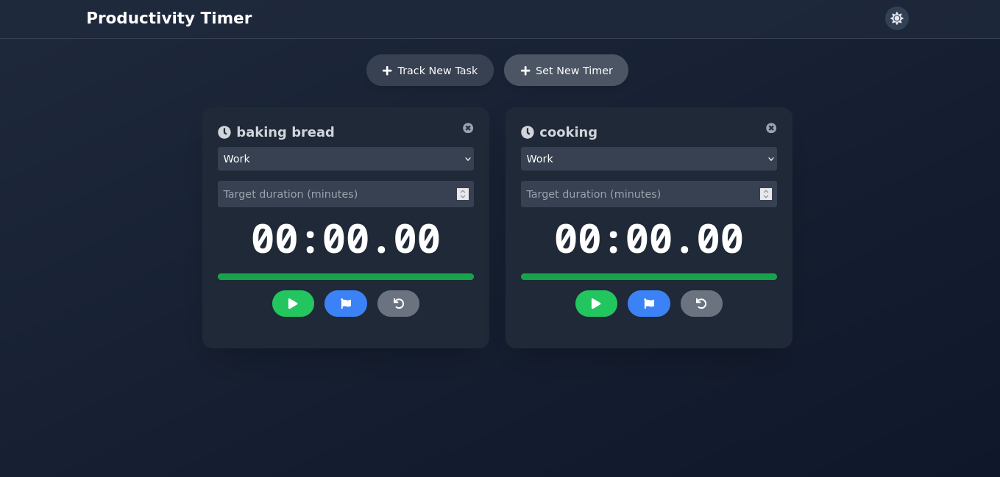
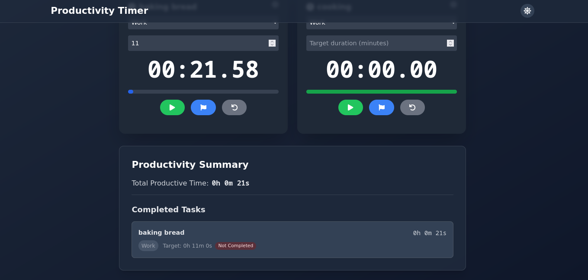

# Productivity Timer Application

## Prodigy InfoTech Internship Project - Task #2
> A web development project completed during my Full Stack Development Internship at Prodigy InfoTech.



## Project Overview

This productivity timer application was developed as part of my internship project at Prodigy InfoTech. It's a comprehensive time management tool built with modern web technologies, demonstrating proficiency in React, TypeScript, and responsive design principles.

### 🎯 Project Goals
- Create an interactive stopwatch application
- Implement multiple timer functionality
- Develop a responsive and user-friendly interface
- Practice modern React development patterns
- Apply TypeScript for type safety

## Features



### Core Functionality
- **Multiple Timers**: Run multiple stopwatches and countdown timers simultaneously
- **Activity Tracking**: Categorize and track different types of tasks
- **Lap Recording**: Track split times with detailed lap recording
- **Target Duration**: Set and monitor time goals
- **Dark Mode**: Toggle between light and dark themes

### Productivity Features
- **Task Management**: Label and organize different activities
- **Detailed Reports**: Generate comprehensive productivity summaries
- **Progress Tracking**: Visual progress indicators
- **Activity Categories**: Organize tasks into predefined categories
  - Work
  - Study
  - Exercise
  - Reading
  - Meditation
  - Hobby
  - Custom tasks

## Technical Stack

- **Frontend Framework**: React 18
- **Language**: TypeScript
- **Build Tool**: Vite
- **Styling**: Tailwind CSS
- **State Management**: React Hooks
- **Icons**: React Icons
- **Version Control**: Git

## Installation

1. Clone the repository:
```bash
git clone https://github.com/Chymezy/PRODIGY_WD_02.git
cd PRODIGY_WD_02
```

2. Install dependencies:
```bash
npm install
```

3. Start the development server:
```bash
npm run dev
```

## Usage

### Quick Start Guide
1. Click "Track New Task" to create a stopwatch
2. Click "Set New Timer" for countdown timer
3. Set task labels and categories
4. Use keyboard shortcuts (Ctrl + S for stopwatch, Ctrl + T for timer)

### Features in Detail
- **Task Labeling**: Give each timer a meaningful name
- **Activity Types**: Choose from predefined categories
- **Progress Tracking**: Monitor completion status
- **Lap Times**: Record and review split times
- **Dark Mode**: Toggle between light and dark themes

## Development Experience

This project was developed during my internship at Prodigy InfoTech, where I:
- Implemented modern React development practices
- Utilized TypeScript for enhanced code reliability
- Created a responsive design using Tailwind CSS
- Developed intuitive user interfaces
- Practiced clean code principles
- Implemented proper state management

## Future Enhancements

- Data persistence with backend integration
- Export functionality for productivity reports
- Additional activity categories
- Team collaboration features
- Mobile application version

## Internship Details

- **Company**: Prodigy InfoTech
- **Position**: Full Stack Development Intern
- **Duration**: September 2024 - October 2024
- **Project Type**: Web Development
- **Task**: #2 - Stopwatch Web Application

## Contact

- Email - [contact me](mailto:chymezy332@gmail.com)
- LinkedIn - [view profile](https://linkedin.com/in/Chymezy)
- Project Link: [https://github.com/Chymezy/PRODIGY_WD_02.git](https://github.com/Chymezy/PRODIGY_WD_02.git)

## Acknowledgments

- Prodigy InfoTech for the internship opportunity
- Mentors and supervisors for their guidance
- React and TypeScript communities for resources and documentation

---
<p align="center">Developed with ❤️ during my internship at Prodigy InfoTech</p>
